 ## 1. Beadandó
 
 Feladat vállalása: 
  Könyvek és idézetek nyílvántartása webes felületen (Mini-moly.hu)
  
  <b>Funkcionális követelmények:</b>
 
<i>Vendégként:</i>
  <ul>
  <li> szeretnék szabadon könyvekre keresni </li>
  <li> szeretnék regisztrálni, illetve belépni ha ezt megtettem </li> 
  <li> szeretnék olvasni könyvek általános információiról </li>
  </ul>

          
 
<i>Felhasználóként:</i>
  <ul>
  <li> szeretnék belépni az oldalra </li> 
  <li> szeretném az olvasott könyveket bejelölni </li> 
 <li> szeretnék új könyvet/idézetet hozzáadni </li> 
 <li> szeretném a kiválasztott könyvet magánkönyvtáramhoz adni </li> 
 <li> szeretném a kiválasztott könyvet kedvencnek jelölni </li>
 <li> szeretném profiladataimat szerkeszteni </li>
 <li> szeretnék kijelentkezni </li>
 </ul>

 
 <b>Nem funkcionális követelmények: </b>
 <ul>
 <li> Felhasználóbarát </li>
 <li> Biztonságos </li>
 <li> Gyors hozzáférés </li> 
 </ul>
 
 ##2.beadandó
 
 
<b>Use-case diagram</b>

 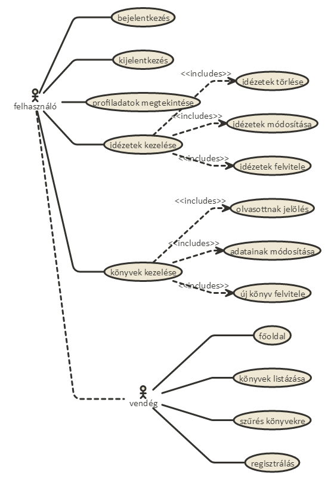
         
 
<b>Adatmodellek</b>
        
 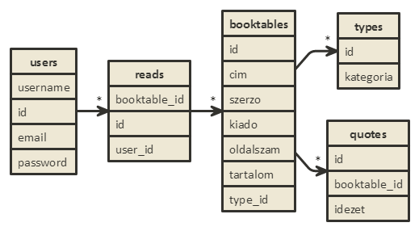
 
<b>Szakterületi fogalomjegyzék</b> 

 <ul> 
 <li><b>Könyv:</b> Bármilyen nyelven íródott szöveget és/vagy képeket tartalmazó
 fizikális vagy digitális gyűjtemény, melyet a szerző és/vagy célközönség
 könyvnek minősített.</li> 
 <li><b>Idézet:</b> Könyvből kiragadott, pár mondatot tartalmazó szöveg.</li> 
 </ul>
 
 
<b>Szerepkörök</b>

 <ul>
 <li><b>vendég: </b>könyvek keresését, böngészését és megtekintését végezheti, illetve regisztrálhat.</li>
 <li><b>felhasználó: </b>a vendég szerepkörén túl saját olvasásait kezelheti, új könyveket illetve idézeteket vihet fel, profiladatait módosíthatja, könyveket jelölhet magánkönyvtárba, illetve kedvencnek. </li>
 </ul>
 
 
<b>Oldaltérkép</b>

 <b>publikus: </b>
 <ul>
 <li> Főoldal</li>
 <li> Könyvek találati listája</li>
 <ul> <li>  Könyv adatainak megtekintése, a hozzátartozó idézetekkel együtt. </li></ul>
 <li> Belépés</li>
 <li> Regisztráció </li>
 </ul> 
 <b>felhasználó: </b>
 <ul>
 <li> Kilépés </li>
 <li> Profiladatok </li>
 <ul><li> Olvasott könyvek megtekintése</li></ul>
 <li> Új könyv felvitele </li>
 <li> Új idézet felvitele </li> 
 <li> Olvasott könyvek kezelése </li> 
 <ul><li>  Hozzáadás a listához</li></ul> 
 <li> Könyvek szűrése</li>
 <ul><li> Könyv adatainak módosítása <li> <li> idézetek megtekintése</li><ul><li>idézet törlése</li> <li> idézet módosítása</li></ul><li>olvasottnak jelölés</li></ul>
 </ul>
 
 
<b>Folyamatok meghatározása</b>

 
Könyv adatinak módosítása felhasználóknak

 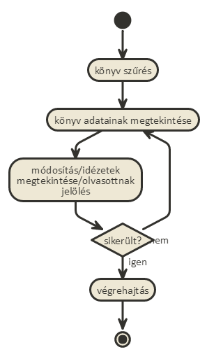
 
Idézet felvitele (könyv esetén is)

 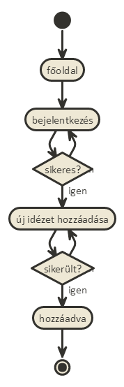
 
 
<b>Végpontok</b>

 <ul>
 <li> <b> GET/:</b> főoldal</li> 
 <li> <b> GET/login:</b> bejelentkező oldal</li> 
 <li> <b> POST/login:</b> bejelentkezési adatok feltöltése</li> 
 <li> <b> GET/reg:</b> regisztráció oldal </li>
 <li> <b> POST/reg: </b> regisztrációs adatok feltöltése</li>
 <li> <b> GET/profile/user_id:</b> profiladatok lekérése</li> 
 <li> <b> GET/books:</b> könyvlista</li> 
 <li> <b> GET/book/:id :</b> könyv megtekintése</li> 
 <li> <b> GET/books/:id/:quotes:</b> könyv idézeteinek megtekintése</li> 
 <li> <b> GET/addBook:</b> új könyv felvitele, és űrlap megtekintése</li> 
 <li> <b> POST/addBook:</b> új könyv felvitele, adatok küldése</li> 
 <li> <b> GET/addQuote:</b> új idézet felvitele, és űrlap megtekintése</li>
 <li> <b> POST/addQuote: </b> új idézet adatainak beküldése</li> 
 <li> <b> GET/books/:id/edit:</b> könyv módosítás űrlap</li> 
 <li> <b> POST/books/:id/edit:</b> könyv módosítás adatinak feltöltése</li> 
 <li> <b> GET/books/:id/quotes/:id/delete: </b> idézet törlése</li>
 <li> <b> GET/books/:id/quotes/:id/edit: </b> idézet módosítási űrlap</li>
 <li> <b> GET/books/:id/addRead:</b> könyv olvasottnak jelölése</li> 
 <li> <b> POST/books/:id/addRead:</b> olvasottnak jelölés adatinak feltöltése</li> 
 <li> <b> GET/type/:id: </b> típus szerinti könyvszűrés </li>
 <li> <b> GET/allBook: </b> minden könyv listázása </li>
 <li> <b> GET/logout: </b> kijelentkezés </li>
 
 </ul>
 
 
<b>Oldalvázlat</b>

 
Főoldal

 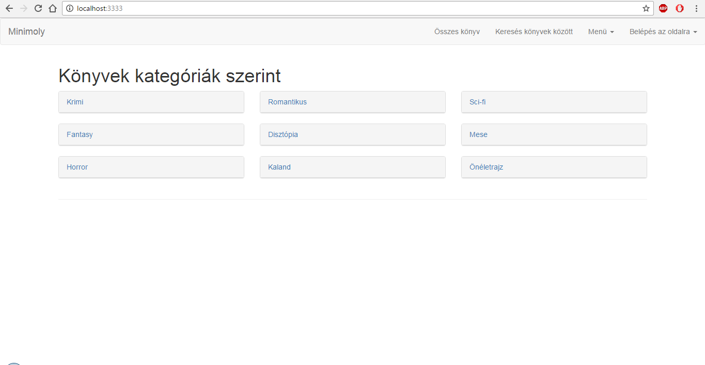
 
Profil

 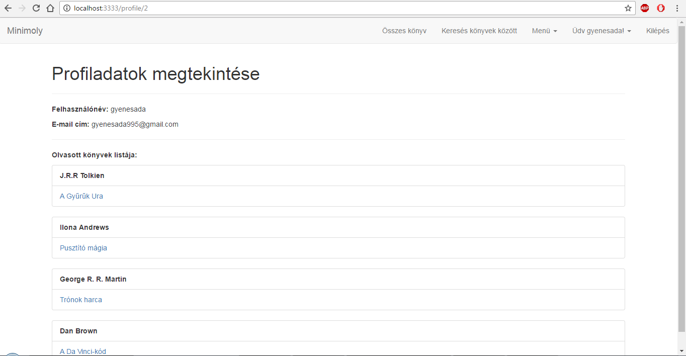
 
Könyv adatok

 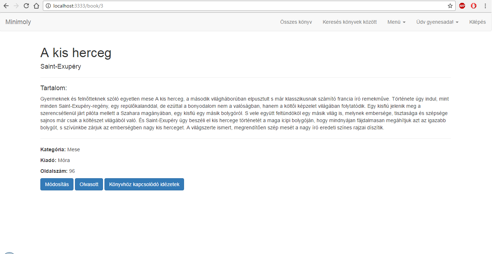
 
Szűrés

 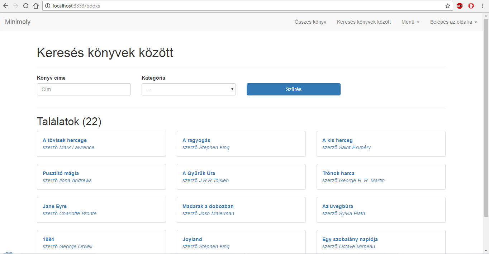
 
Új könyv/idézet hozzáadása

 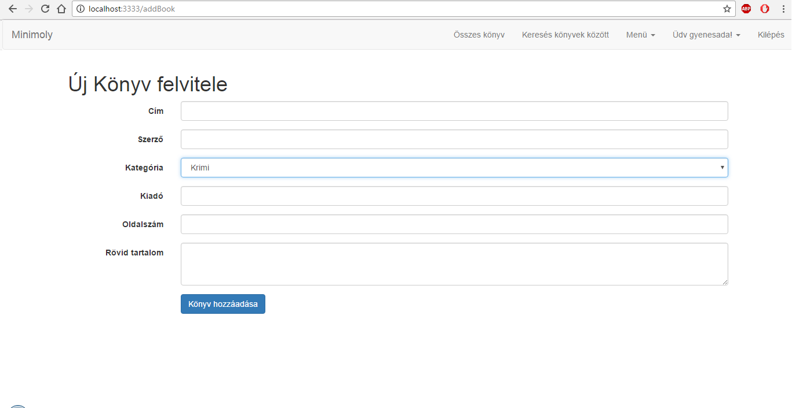
 
Belépés

 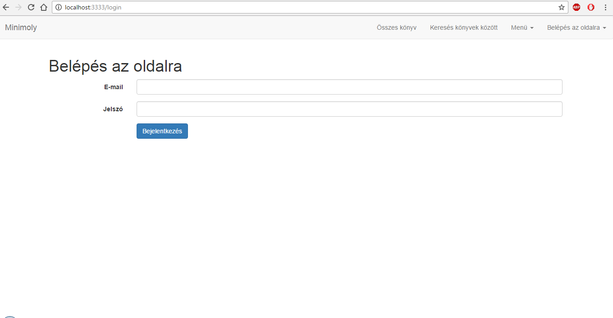
  
Regisztráció

 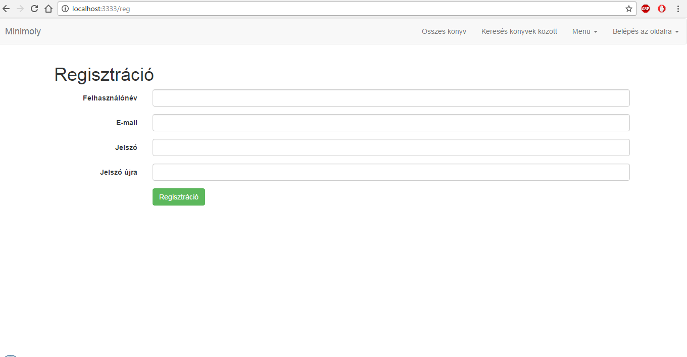
 
Idézet oldal

 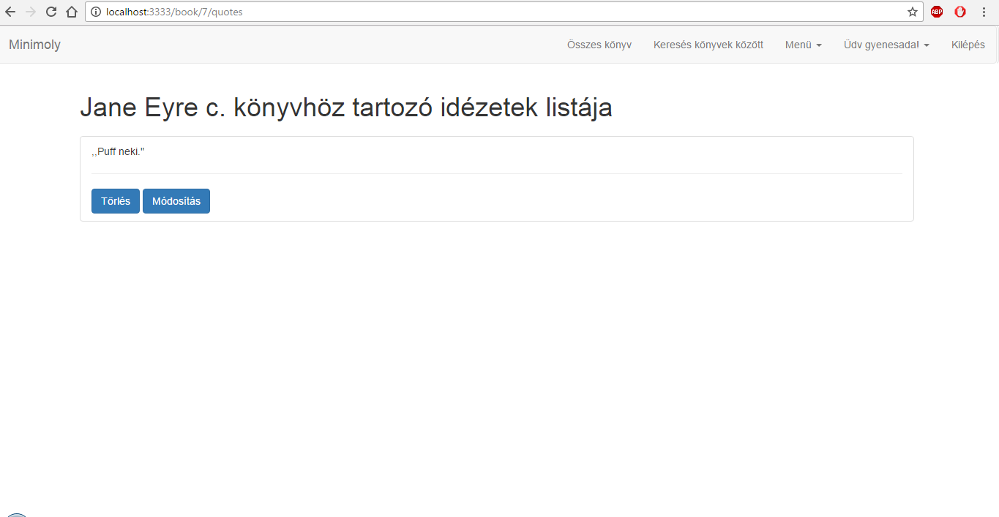
 
