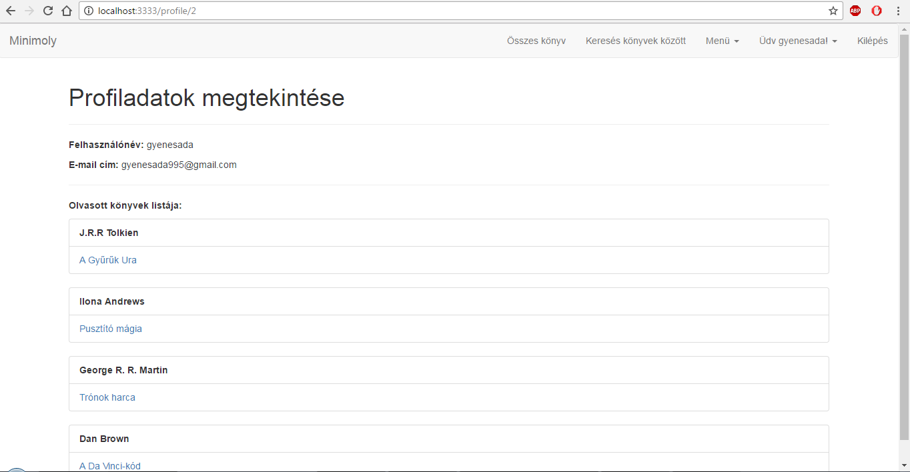
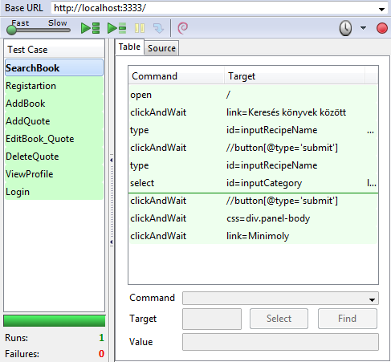

<h1>1. Beadandó</h1>
 
 Feladat vállalása: 
  Könyvek és idézetek nyílvántartása webes felületen (Mini-moly.hu)
  
<h2><b>Funkcionális követelmények:</b></h2>
 
<i>Vendégként:</i>
  <ul>
  <li> szeretnék szabadon könyvekre keresni </li>
  <li> szeretnék regisztrálni, illetve belépni ha ezt megtettem </li> 
  <li> szeretnék olvasni könyvek általános információiról és a hozzátartozott idézeteket megtekinteni</li>
  <li> szűrni könyvekre több feltétel szerint </li>
  </ul>

          
 
<i>Felhasználóként:</i>
  <ul>
  <li> szeretnék belépni az oldalra </li> 
  <li> szeretném az olvasott könyveket bejelölni </li> 
 <li> szeretnék új könyvet/idézetet hozzáadni </li> 
 <li> szeretném a meglévő könyveket/idézeteket módosítani </li> 
 <li> szeretném a fentlévő idézeteket törölni </li>
 <li> szeretném profiladataimat megtekinteni </li>
 <li> szeretnék kijelentkezni </li>
 </ul>

 
<h2><b>Nem funkcionális követelmények: </b></h2>
 <ul>
 <li> Felhasználóbarát </li>
 <li> Biztonságos </li>
 <li> Gyors hozzáférés </li> 
 </ul>
 
<h1>2.beadandó</h1>
 
 <h2>
<b>Use-case diagram</b>
</h2>
 
         
 <h2>
<b>Adatmodellek</b>
</h2>
 
 <h2>
<b>Szakterületi fogalomjegyzék</b> 
</h2>
 <ul> 
 <li><b>Könyv:</b> Bármilyen nyelven íródott szöveget és/vagy képeket tartalmazó
 fizikális vagy digitális gyűjtemény, melyet a szerző és/vagy célközönség
 könyvnek minősített.</li> 
 <li><b>Idézet:</b> Könyvből kiragadott, pár mondatot tartalmazó szöveg.</li> 
 </ul>
 
 <h2>
<b>Szerepkörök</b>
</h2>
 <ul>
 <li><b>vendég: </b>könyvek keresését, böngészését és megtekintését végezheti, illetve regisztrálhat.</li>
 <li><b>felhasználó: </b>a vendég szerepkörén túl saját olvasásait kezelheti, új könyveket illetve idézeteket vihet fel, módosíthatja, illetve törölheti a kívánt idézeteket. </li>
 </ul>
 
 <h2>
<b>Oldaltérkép</b>
</h2>
 <b>publikus: </b>
 <ul>
 <li> Főoldal</li>
 <li> Könyvek találati listája</li>
 <ul> <li>  Könyv adatainak megtekintése, a hozzátartozó idézetekkel együtt. </li></ul>
 <li> Belépés</li>
 <li> Regisztráció </li>
 </ul> 
 <b>felhasználó: </b>
 <ul>
 <li> Kilépés </li>
 <li> Profiladatok </li>
 <ul><li> Olvasott könyvek megtekintése</li></ul>
 <li> Új könyv felvitele </li>
 <li> Új idézet felvitele </li> 
 <li> Olvasott könyvek kezelése </li> 
 <ul><li>  Hozzáadás a listához</li></ul> 
 <li> Könyvek szűrése</li>
 <ul><li> Könyv adatainak módosítása <li> <li> idézetek megtekintése</li><ul><li>idézet törlése</li> <li> idézet módosítása</li></ul><li>olvasottnak jelölés</li></ul>
 </ul>
 
 <h2>
<b>Folyamatok meghatározása</b>
</h2>
 
Könyv adatinak módosítása felhasználóknak

 
 
Idézet felvitele (könyv esetén is)

 
 
 <h2>
<b>Végpontok</b>
</h2>
 <ul>
 <li> <b> GET/:</b> főoldal</li> 
 <li> <b> GET/login:</b> bejelentkező oldal</li> 
 <li> <b> POST/login:</b> bejelentkezési adatok feltöltése</li> 
 <li> <b> GET/reg:</b> regisztráció oldal </li>
 <li> <b> POST/reg: </b> regisztrációs adatok feltöltése</li>
 <li> <b> GET/profile/user_id:</b> profiladatok lekérése</li> 
 <li> <b> GET/books:</b> könyvlista</li> 
 <li> <b> GET/book/:id :</b> könyv megtekintése</li> 
 <li> <b> GET/books/:id/:quotes:</b> könyv idézeteinek megtekintése</li> 
 <li> <b> GET/addBook:</b> új könyv felvitele, és űrlap megtekintése</li> 
 <li> <b> POST/addBook:</b> új könyv felvitele, adatok küldése</li> 
 <li> <b> GET/addQuote:</b> új idézet felvitele, és űrlap megtekintése</li>
 <li> <b> POST/addQuote: </b> új idézet adatainak beküldése</li> 
 <li> <b> GET/books/:id/edit:</b> könyv módosítás űrlap</li> 
 <li> <b> POST/books/:id/edit:</b> könyv módosítás adatinak feltöltése</li> 
 <li> <b> GET/books/:id/quotes/:id/delete: </b> idézet törlése</li>
 <li> <b> GET/books/:id/quotes/:id/edit: </b> idézet módosítási űrlap</li>
 <li> <b> GET/books/:id/addRead:</b> könyv olvasottnak jelölése</li> 
 <li> <b> POST/books/:id/addRead:</b> olvasottnak jelölés adatinak feltöltése</li> 
 <li> <b> GET/type/:id: </b> típus szerinti könyvszűrés </li>
 <li> <b> GET/allBook: </b> minden könyv listázása </li>
 <li> <b> GET/logout: </b> kijelentkezés </li>
 
 </ul>
 
 <h2>
<b>Oldalvázlat</b>
</h2>
 
Főoldal

 
 
Profil

 
 
Könyv adatok

 
 
Szűrés

 
 
Új könyv/idézet hozzáadása

 
 
Belépés

 
  
Regisztráció

 
 
Idézet oldal

 
 
 <h2> 
 <b> JavaScript-el történő fejlesztések </b> 
 </h2>
 <ul>
 <li> <b> AJAX Funkciók </b> 
 <ul> <li> ajaxDelete.js - Törlési megerősítés idézetek törlése közben. </li> 
 <li> ajaxLogin.js - Bejelentkezés esetén felugró ablak. </li>
 <li> ajaxLogout.js - Kijelentkezés esetén megerősítés. </li>
 </ul>
 </li>
 <li> <b> Egyéb funkciók </b>
 <ul><li> Űrlap validáció - Új könyv hozzáadása esetén megvizsgálja a bemeneti adatok helyességét/meglétét.</li>
 <li> Űrlap validáció - Új idézet hozzáadása esetén megvizsgálja a bemenetei adatok helyességét/meglétét.</li>
 <li> Legördülő menü - JavaScript bekapcsolása mellett a 'Menü' fül legördülő menü lesz. </li>
 <li> Legördülő menü - JavaScript bekapcsolása mellett az 'Üdv [felhasználó]!' fül legördülő menü lesz. </li>
 </ul></li>
 </ul>
 
 
 <h2> 
 <b> Funkcionális tesztelés </b> 
 </h2>

 <b> Tesztesetek </b> 

 <ul><li> Bejelentkezés - kijelentkezés: <i> ok. </i> - <a href="/tests/Login_logout.html"> link </a></li>
 <li> Regisztráció: <i> ok. </i> - <a href="/tests/Registration.html"> link </a></li>
 <li> Könyvek közötti keresés: <i> ok. </i> - <a href="/tests/SearchBooks.html"> link </a></li>
 <li> Könyv hozzáadása: <i> ok. </i> - <a href="/tests/AddBook.html"> link </a></li>
 <li> Könyv és idézet szerkesztése: <i> ok. </i> - <a href="/tests/EditBook_Quote.html"> link </a></li>
 <li> Idézet hozzáadása: <i> ok. </i> - <a href="/tests/AddQuote.html"> link </a></li>
 <li> Idézet törlése: <i> ok. </i> - <a href="/tests/DeleteQuote.html"> link </a></li>
 </ul>
 
 
 
 
 
<h2>
<b>Felhasználói dokumentáció </b>
</h2>

<b>Szükséges: </b>
<ul> <li> <b> operációs rendszer: </b>tetszőleges.</li>
<li><b> hardver: </b> operációs rendszer szerint megadva. </li>
<li><b> egyéb: </b> böngésző használata (JavaScript ajánlott)</li>
</ul>

<b>Használat:</b> 

<ol>
<li> Böngésző megnyitása, főoldalra lépés </li>
<li> Jobb felső sarokban a belépés az oldalra legördülő menüben kiválasztjuk a Regisztrációt/Bejelentkezés.</li>
<li> Ezek után visszakerülünk a főoldalra.</li>
<li> A Menü legördülő lista alatt kiválasztjuk az új könyv/idézet felvitele opciót.</li>
<li> Űrlap kitöltése.</li>
<li> Hiba esetén ismételt kitöltés. </li>
<li> Adatok beküldése, mentése.</li>
<li> Főoldalon: Kategóriák szerint könyvek csoportosítása.</li>
<li> Könyv oldal: Módosításra kattintva, a már létező könyvek adatait tudjuk módosítani, felküldeni és menteni.</li>
<li> Könyv oldal: Olvasottnak jelölés esetén a könyvet olvasottnak jelölhetjük.</li>
<li> Könyv oldal: Könyvhöz kapcsolódó idézetekre kattintva idézetgyűjtő oldalra jutunk.</li>
<li> Idézet oldal: Törlés gombra kattintva, kiválasztott idézethez tartozó idézet törlése.</li>
<li> Idézet oldal: Módosítás esetén már meglévő idézet adatait tudjuk módosítani.</li>
<li> Az oldalon fent megtaláljuk az összes könyv opciót, ami hozzáadás sorrendjében kilistázza az oldalon található összes könyvet.</li>
<li> Profil: Saját adatainkon kívül megtudjuk tekinteni az általunk olvasottnak jelölt könyveket.</li>
<li> Könyvek böngészése: Kategória és cím alapján tudunk szűrni az oldalon lévő könyvekre. A címre kattintva előjön a kiválasztott könyv adatlapja.</li>
<li> A folyamat befejezéseként válasszuk ki a jobb felső sarokban található Kijelentkezés funkciót.</li></ol>

